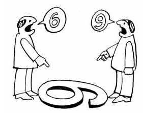
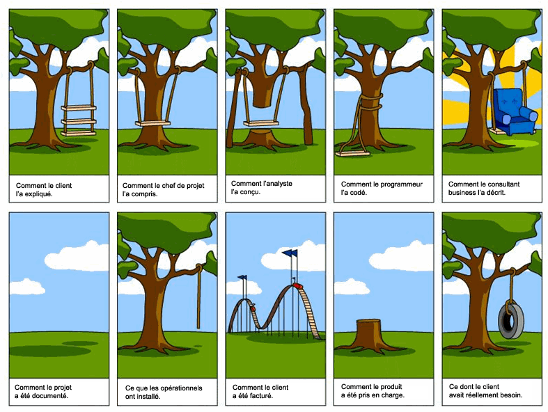

:css: pycon/css/pycon.css
:title: BDD avec Behave (et Django 1.7)
:author: Christophe Brun
:event: PyconFR 2014
:description: Python, Behave, BDD, Django
:data-transition-duration: 1300
:pygments: monokai

:id: homepage

BDD avec Behave (et Django 1.7)
===============================

Christophe Brun
---------------

----

:id: intro

Introduction BDD
================
- Le BDD (Behavior Driven Development) : le Développement Piloté par le Comportement.
- Pratique Agile visant la collaboration des acteurs techniques ou non d'un projet
- en pratique
    - participation de l'ensemble des acteurs  à l'élaboration de l'application
    - rédaction des comportements des éléments de l'application
    - automatisation des tests en cohérence avec les comportements
    - responsabilisation de l'application face aux comportement : "devrait" plutôt que "devoir"
    - Utilisation de "Bouchon" sur les éléments non encore traités

----

:id: sans_bdd

Sans BDD, cela peut donner
==========================

----

:id: avec_bdd
:data-rotate: 90

Avec BDD
========

- La fonctionnalité balançoire est décrite au travers de scénarios
- un exemple de comportement que devrait avoir la balançoire

.. code-block:: cucumber

    Fonctionnalité: Fonctionnement de ma balançoire

    Scénario: Utilisation standard de ma balançoire
        Soit je suis assis sur la planche de bois
        Quand je me pousse en arrière avec les pieds
        Alors je devrais me balancer d'avant en arrière 
        Quand je ne bouge pas 
        Alors le balancement devrait s'arrêter au bout d'un moment

- Description simple des comportements avec un language naturel
- plus il y a de scénarios et plus il y a de précisions 

----

:id: gherkin

Gherkin
=======

- Gherkin est un language de description des comportements métiers
    - il est multi-langues (proche de 40)
    - il est compris par cucumber, behave, behat, ...
- ses objectifs :
    - documentation et tests automatiques
    - alerte en cas de problème
- Conventions
    - un fichier par fonctionnalité
    - un fichier d'extension ``.feature``

----

:id: exemple_gherkin

Exemples de scénario
====================

.. code-block:: cucumber

    Fonctionnalité: Gestion des comptes utilisateurs
        Description de la fonctionnalité
        pour détailler les choses

        Contexte:
            Soit je suis authentifié en admin
            Et j'accède au backoffice

        Scénario: Création d'un compte utilisateur
            Soit je clique sur le menu utilisateur
            Et je clique sur ajouter
            Alors le formulaire de création de compte devrait s'afficher
            Quand je remplis le champ "nom" avec "Brun"
            Et je remplis le champ "prénom" avec "Christophe"
            Et je clique sur valider
            Alors le message "Nouveau compte créé" devrait s'afficher 
        

        Plan du scénario: Ajouter plusieurs comptes
            Soit j'appel la fonction ajouter un utilisateur 
            Quand je remplis le champ "nom" avec <nom>
            Et je remplis le champ "prénom" avec <prénom>
            Et je clique sur valider
            Alors le message "Nouveau compte créé" devrait s'afficher 

            Exemples:
                | nom       | prénom            |
                | Brun      | Christophe        |
                | Dark      | Vader             |

----

:id: behave
:data-rotate-x: 180

Behave
======

- Behave comprend le language gherkins
- Behave execute le code python des steps
- Installation 

.. code-block:: bash

        pip install behave

- arborescence de tests pour un projet "classique"

.. code-block:: bash

    features
      |-- fonctionnalite1.feature
      |-- fonctionnalite2.feature
      |-- steps
      |     |-- backoffice.py
      |     |-- authentification.py

----

:id: steps

Steps ??
========

- Passerelle Gherkin <-> Python
- Un exemple

.. code-block:: cucumber

    Fonctionnalité: Bonjour le monde
        Affiche bonjour le monde à l'écran

        Scenario: lancement de l'application
            Quand je lance l'application
            Alors je devrais voir "Bonjour le monde"

- On lance

.. code-block:: console
    
    $ behave --lang fr
    ..
    ..
    You can implement step definitions for undefined steps with these snippets:

    @when(u'je lance l\'application')
    def step_impl(context):
        assert False

    @then(u'je devrais voir "Bonjour le monde"')
    def step_impl(context):
        assert False

----

:id: code_steps

On code nos steps 
=================

- dans un fichier de ``features/steps``

.. code-block:: python

    from behave import *

    @when(u'je lance l\'application')
    def step_impl(context):
        assert True

    @then(u'je devrais voir "{text}"')
    def step_impl(context, text):
        assert True

- Et ça donne

.. code-block:: console

    $ behave --lang fr
    Fonctionnalité: Bonjour le monde # features/BonjourLeMonde.feature:1
        Affiche bonjour le monde à l'écran
        Scénario: lancement de l'application       # features/BonjourLeMonde.feature:4
            Quand je lance l'application             # features/steps/MonApplication.py:5 0.000s
            Alors je devrais voir "Bonjour le monde" # features/steps/MonApplication.py:9 0.000s

    1 feature passed, 0 failed, 0 skipped
    1 scenario passed, 0 failed, 0 skipped
    2 steps passed, 0 failed, 0 skipped, 0 undefined
    Took 0m0.000s

----

:id: dark_notes
:data-rotate: -90

Dans la vrai vie
================

Dark notes
----------

"Il y a bien longtemps, dans une galaxie lointaine, très lointaine ...."

* Ses besoins
    * une liste des planètes à envahir
    * une TODO List pour chaque planète
    * Lorsque l'ensemble des TODO d'une planètes sont "Done" alors lancement de l'attaque
    * Une interface backoffice
    * Une interface web front simple

----

:id: on_commence

On commence par ....
====================

Ecrire des comportements
------------------------

.. code-block:: cucumber

    Fonctionnalité: Liste des planètes en mode admin
        Affiche la liste des planètes et les informations associées

        Contexte:
            Soit je me connecte à l'application en "Dark Vader"

        Scenario: lancement de l'application
            Quand je lance l'application
            Alors je devrais voir "Bonjour le monde"

    

----

:id: application

L'application
=============

- Installation de Django et initialisation de notre application **dark_notes**
- Installation de l'extensions django-behave

.. code-block:: console

    pip install django-behave

- Dans le fichier settings : 
    - ``django_behave`` dans INSTALLED_APPS 
    - TEST_RUNNER = 'django_behave.runner.DjangoBehaveTestSuiteRunner' 
- Initialiser 
    - ajouter l'arborescence behave dans l'app Django
    - ajouter un fichier environment.py

.. code-block:: python

    from splinter.browser import Browser

    def before_all(context):
        context.browser = Browser('chrome')

    def after_all(context):
        context.browser.quit()
        context.browser = None

----

:id: scenario_simple

Un scénario simple
==================

.. code-block:: cucumber

    Fonctionnalité: Gestion des planètes

        Scénario: Liste des planètes à envahir
            Soit je suis sur le site
            Quand j'ouvre la page d'accueil du site
            Alors je devrais voir "Planètes à envahir"
            Et il y a au moins une planète 

Cela donne les steps suivants

.. code-block:: python

    # -*- coding: utf-8 -*-
    from behave import *

    @then(u'je devrais voir "{text}')
    def impl(context, text):
        return context.browser.is_text_present(text)

    @when(u'j\'ouvre la page d\'accueil du site')
    def impl(context):
        return context.browser.visit('http://localhost:8000/')

    @given(u'je suis sur le site')
    def impl(context):
        return True

    @then(u'il y a au moins une planète')
    def impl(context):
        assert True # ....

----

:id: steps_01

Steps (1/3)
===========

Utilisation de variables
------------------------

.. code-block:: cucumber

    Quand je m'authentifie avec le compte "admin/password"

Cela donne

.. code-block:: python

    @when(u'''Je m'authentifie avec le compte "{compte}"''')
    def impl(context, compte):
        login, passwd  = compte.split('/')
        context.browser.fill('username',login)
        context.browser.fill('password',passwd)

----

:id: steps_02

Steps (2/3)
===========

Re-use
------

.. code-block:: cucumber

    Quand Je me connecte au backoffice avec le compte "{compte}"

On réutilise

.. code-block:: python

    @when(u'Je me connecte au backoffice avec le compte "{compte}"')
    def impl(context, compte):
        context.execute_steps(u'''
            Quand Je m'authentifie avec le compte "{compte}"
            Et Je clique sur le bouton "Log in"
            '''.format(compte=compte))

----

:id: steps_03

Steps (3/3)
===========

Plan de scénario
----------------

.. code-block:: cucumber

        Scénario: Envahir des planètes
            Soit la liste des planètes
                | nom              | Climat  |
                | Abafar           | Chaud   |
                | Alderaan         | Tempéré |
                | hoth             | Froid   |
                | Tatoïne          | Chaud   |
            Quand J'affiche la liste des planètes
            Alors on devrait avoir 2 planète(s) au climat "chaud"
            Et on devrait avoir 1 planète(s) au climat "Froid"

Initialisation de la liste

.. code-block:: python

    @given('la liste des planètes')
    def step_impl(context):
        for row in context.table:
            p=Planete(nom=row['nom'], climat=row['climat'])
            p.save()

----

:id: client_steps

Browser,  client web, autre
===========================

Tests de l'IHM
--------------

* Splinter : framework de test d'application web
* Client Django : 
* Pas de client : utilisation de l'ORM, requête directe

Oui, mais pas que 
-----------------

* step pour valider des envois de mail
* step pour valider un model, une view , un template

----

:id: et_apres

Et après ?
==========

- les Scénarios sont utilisables
    - en intégration continue
    - pour la documentation ou manuel utilisateur
    - pour la formation client ou interne (TMA)
    - peuvent être utilisé comme sondes de monitoring
   
- plus on fait des tests, plus on a des steps, plus on gagne de temps
  et donc plus on fait des tests

----

:id: fin

Merci
=====

Presentation
------------
* https://github.com/chbrun/pycon-2014_BDD_Behave
* @chbrun

