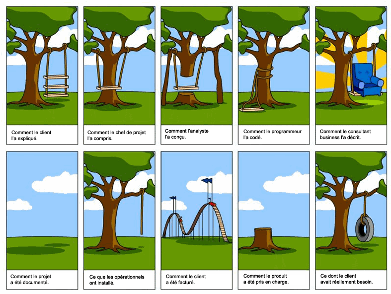

:css: bdd_behave.css
:title: BDD avec Behave (et Django 1.7)
:author: Christophe Brun
:event: PyconFR 2014
:description: Python, Behave, BDD, Django
:data-transition-duration: 1300
:pygments: monokai

:id: homepage

BDD avec Behave (et Django 1.7)
===============================

Christophe Brun
---------------

----

:id: intro

Introduction BDD
================
- Le BDD (Behavior Driven Development) : le Développement Piloté par le Comportement.
- Pratique Agile visant la collaboration des acteurs techniques ou non d'un projet
- en pratique
    - participation de l'ensemble des acteurs  à l'élaboration de l'application
    - rédaction des comportements des éléments de l'application
    - automatisation des tests en cohénrece de ces comportements
    - responsabilisation de l'application face aux comportement : "devrait" plutôt que "devoir"
    - Utilisation de "Bouchon" sur les éléments non encore traités

----

Sans BDD, cela peut donner
==========================

----

:data-rotate: 90

Avec BDD
========

- La fonctionnalité balançoire est décrite au travers de scénarios
- un exemple de comportement que devrait avoir la balançoire

.. code-block:: cucumber

    Fonctionnalité: Fonctionnement de ma balançoire

    Scénario: Utilisation standard de ma balaçoire
        Soit je suis assis sur la planche de bois
        Quand je me pousse en arrière avec les pieds
        Alors je devrais me balancer d'avant en arrière 
        Quand je ne bouge pas 
        Alors le balancement devrait s'arrêter au bout d'un moment

- Description simple des comportements avec un language naturel
- plus il y a de scénarios et plus il y a de précisions

----

:id: gherkin

Gherkin
=======

- Gherkin est un language de description des comportements métiers
    - il est multi-langues (proche de 40)
    - il est compris par cucumber, behave, behat, ...
- ses objectifs :
    - documentation et tests automatiques
    - alerte en cas de problème
- Conventions
    - un fichier par fonctionnalité
    - un fichier d'extension ``.feature``

.. image:: PickledGherkin.JPG
    :width: 220px
    :alt: cucumber
    :align: center

----

:data-rotate-x: 180

Behave
======

- Behave comprend le language gherkins
- Behave execute le code python corresponsdant
- Installation 

.. code-block:: bash

        pip install behave

- arborescence de tests

.. code-block:: bash

    features
      |-- fonctionnalite1.feature
      |-- fonctionnalite2.feature
      |-- steps
      |     |-- backoffice.py
      |     |-- authentification.py

----

Steps ??
========

- Passerelle Gherkin <-> Python
- Un exemple

.. code-block:: cucumber

    Fonctionnalité: Bonjour le monde
        Affiche bonjour le monde à l'écran

        Scenario: lancement de l'application
            Quand je lance l'application
            Alors je devrais voir "Bonjour le monde"

- On lance

.. code-block:: console
    
    $ behave --lang fr
    ..
    ..
    You can implement step definitions for undefined steps with these snippets:

    @when(u'je lance l\'application')
    def step_impl(context):
        assert False

    @then(u'je devrais voir "Bonjour le monde"')
    def step_impl(context):
        assert False

----

On code nos steps 
=================

- dans un fichier de ``features/steps``

.. code-block:: python

    from behave import *

    @when(u'je lance l\'application')
    def step_impl(context):
        assert True

    @then(u'je devrais voir "{text}"')
    def step_impl(context, text):
        assert True

- Et ça donne

.. code-block:: console

    $ behave --lang fr
    Fonctionnalité: Bonjour le monde # features/BonjourLeMonde.feature:1
        Affiche bonjour le monde à l'écran
        Scénario: lancement de l'application       # features/BonjourLeMonde.feature:4
            Quand je lance l'application             # features/steps/MonApplication.py:5 0.000s
            Alors je devrais voir "Bonjour le monde" # features/steps/MonApplication.py:9 0.000s

    1 feature passed, 0 failed, 0 skipped
    1 scenario passed, 0 failed, 0 skipped
    2 steps passed, 0 failed, 0 skipped, 0 undefined
    Took 0m0.000s

----

Et après ?
==========

- les Scénarios sont utilisables
    - en intégration continue
    - pour la documentation ou manuel utilisateur
    - pour la formation client ou interne (Maintenance)
    - peuvent être utilisé comme sondes
   
- alimente une banque de ``steps``
    - gain 

----

Questions ??
============

